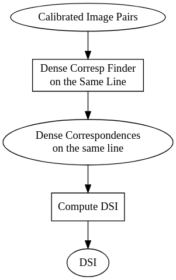

# Overview 

The Calibrated Image Pair content 

- the image pair comes from a calibrated sensor or they have been rectified so there is guaranteed that epipolar lines correspond to image lines 

- matching are performed between pixel on the same image lines 
