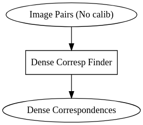

# Overview 

Uncalibrated Image Pair Dense Matching 

- No DSI as there is no assumption the matched points are on the same image line (hence epipolar lines do not correspond to the image lines)

- In order to achieve this the calibration is needed or images need to be rectified 
